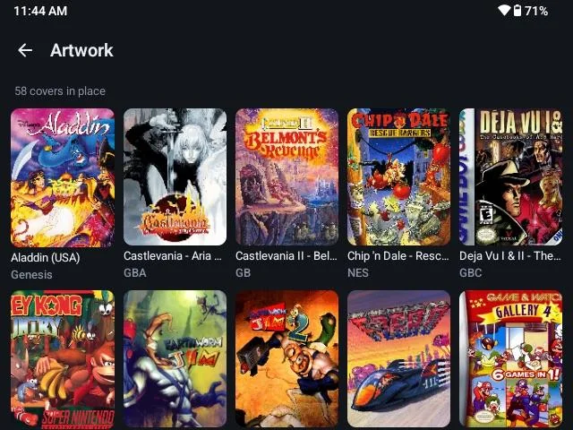
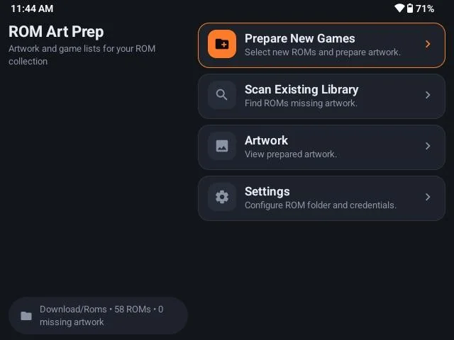
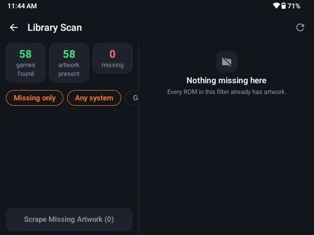

# ROM Art Prep

**ROM Art Prep is a standalone Android artwork scraper for ROM collections.**

It was created to solve a simple problem: sometimes you want artwork for your ROMs without installing an entirely different frontend just to get a scraping feature.

ROM Art Prep scans your ROM folders, identifies the game system, searches available artwork sources, downloads matching artwork, and can generate `gamelist.xml` files for compatible frontends.

It is designed to work with existing ROM collections rather than replace your emulator or frontend.

## What It Does

- 📁 Scan a ROM folder and its system subfolders
- 🎮 Identify supported game systems from filenames, extensions, and folder names
- 🖼️ Search for and download game artwork
- ⚙️ Choose which supported systems ROM Art Prep should search for artwork
- 🚫 Ignore specific filenames so unwanted files are excluded from future scans
- 🔎 Support alternate system names and RetroArch/Libretro folder naming
- ✋ Provide manual artwork selection when automatic matching cannot identify a game
- ⚡ Process ROMs one at a time with fast jobs completed immediately and slower searches handled through a queue
- 📋 Generate and update `gamelist.xml` files
- 💾 Remember artwork matches while avoiding incorrect matches between different ROM files
- 📱 Continue scanning safely when the Android app is placed in the background
- 🧪 Provide diagnostic information to help troubleshoot difficult searches

## Why ROM Art Prep?

Many Android emulation frontends already include artwork scraping, but sometimes you don't want to change your frontend or install another launcher just to obtain artwork.

ROM Art Prep is intentionally separate.

You can keep using the frontend and emulators you already like, while using ROM Art Prep as a dedicated artwork preparation tool.

## System Detection

ROM Art Prep can recognize systems using several types of information, including:

- System folder names
- Common alternate system names
- File extensions
- RetroArch/Libretro folder names

For example, folders such as:

- `Nintendo - Super Nintendo Entertainment System`
- `Nintendo - Game Boy Advance`
- `Sony - PlayStation`
- `Sony - PlayStation 2`
- `Sega - Mega Drive - Genesis`

can be recognized without requiring the user to manually select the system.

The app intentionally avoids overly broad manufacturer-only names such as `Nintendo`, `Sega`, or `Commodore` because those names can refer to multiple different systems.

## System Selection

ROM Art Prep can automatically detect the system for each file, while also allowing users to choose which supported systems should be included in artwork searches.

All supported systems are enabled by default.

Systems can be turned off in Settings when the user does not want ROM Art Prep to search for artwork for those systems.

Disabled systems are skipped before artwork lookup and network processing.

## Ignored Files

ROM Art Prep allows users to exclude specific filenames from future scans.

When a file is ignored, its exact filename is saved to the user's Ignored Files list. Matching is case-insensitive, but the filename must otherwise match exactly.

Ignored files are excluded before system detection and do not appear in scan results or consume artwork lookup, checksum, network, or retry processing.

Ignored filenames can be reviewed and removed from:

**Settings → Ignored Files**

For convenience, ROM Art Prep also provides an optional shortcut for adding common 3DS system files:

- `boot9.bin`
- `boot11.bin`
- `seeddb.bin`
- `shared_font.bin`

These files are never ignored automatically. The user must explicitly choose to add them.

## Artwork Sources

ROM Art Prep currently uses:

- Hasheous
- Libretro thumbnails

Artwork availability depends on the source and the particular game.

If automatic matching cannot identify a game, the app can provide a manual artwork search so the user can choose an appropriate result.

## Fast Scanning

ROM Art Prep is designed to avoid allowing one difficult ROM search to hold up an entire collection.

The scanner processes one ROM at a time and uses a queue for searches that take longer than expected.

In general:

**Fast match → process immediately**

**Slow search → defer and retry**

**Successful match → download artwork**

**No usable automatic match → ask the user to choose**

This allows the rest of a collection to finish without waiting indefinitely on one difficult title.

## Supported Frontends

ROM Art Prep is not tied to a specific frontend.

The artwork and `gamelist.xml` files it creates can be used by compatible frontends that follow the corresponding folder and metadata conventions.

It can therefore be used alongside an existing frontend rather than requiring you to replace it.

## Android

ROM Art Prep was developed and tested on Android, including the Anbernic RG DS.

The application uses Android's storage permissions and folder selection system so that the user chooses which ROM collection the application is allowed to access.

## Installation

ROM Art Prep is distributed as an Android APK through the **Releases** section of this repository.

Download the latest APK from the latest GitHub release and install it on your Android device.

ROM Art Prep can be installed as an update over an existing compatible installation. Existing app settings and folder permissions should normally be retained when updating.

## Current Status

ROM Art Prep is a public Android release.

Version 1.5.1 has been tested on a physical Anbernic RG DS in addition to automated testing.

The application has been tested against ROM libraries covering normal system folders, RetroArch-style folder names, ambiguous file extensions, unsupported systems, non-game files, ignored files, and artwork matching scenarios.

Additional testing on other Android devices and ROM collections is welcome.

## Diagnostics & Privacy

ROM Art Prep includes optional diagnostic information to help investigate difficult scans.

Diagnostic reports are designed to avoid including ROM contents, artwork, passwords, API keys, authentication tokens, or Android system logs.

Filenames can be excluded from reports, and games can instead be represented anonymously as entries such as `Game 1`.

## Screenshots

## AI-Assisted Development

AI-assisted development tools were used during the creation and troubleshooting of ROM Art Prep.

The project was developed through iterative testing, investigation, debugging, and verification on actual Android hardware.

## License

See the repository for licensing information.

## Feedback

If you find a bug, have a suggestion, or encounter a ROM/system that does not behave as expected, please open an issue with as much useful information as possible.

Screenshots and diagnostic information can be especially helpful when investigating problems.

---

**ROM Art Prep**

A simple tool for getting your ROM artwork ready without changing the way you play your games. 🎮

## Copyright

Copyright © 2026 by Developer. All rights reserved.

ROM Art Prep is provided publicly for viewing, testing, and discussion. No license is granted to reproduce, redistribute, modify, or commercially distribute the software or derivative works without permission from the copyright holder.
